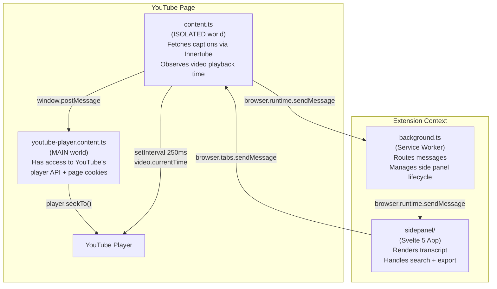
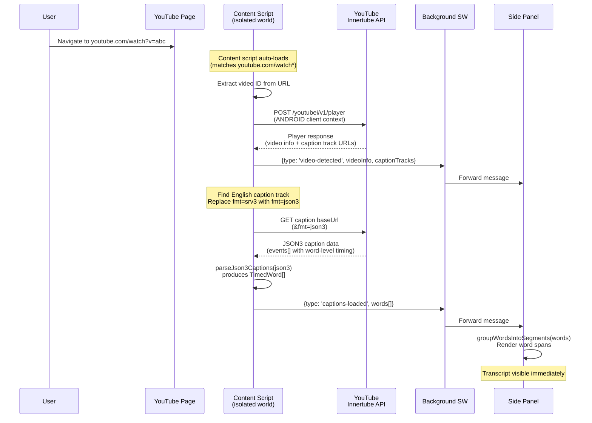
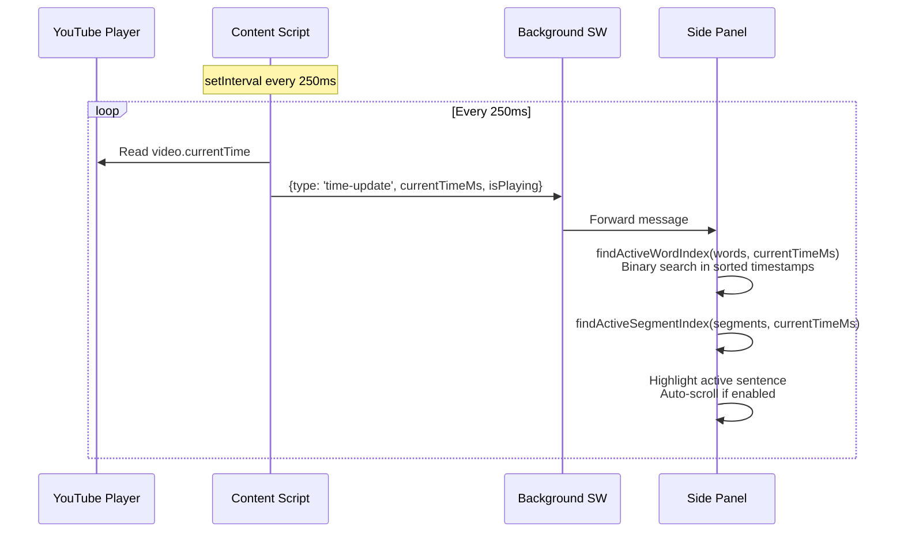
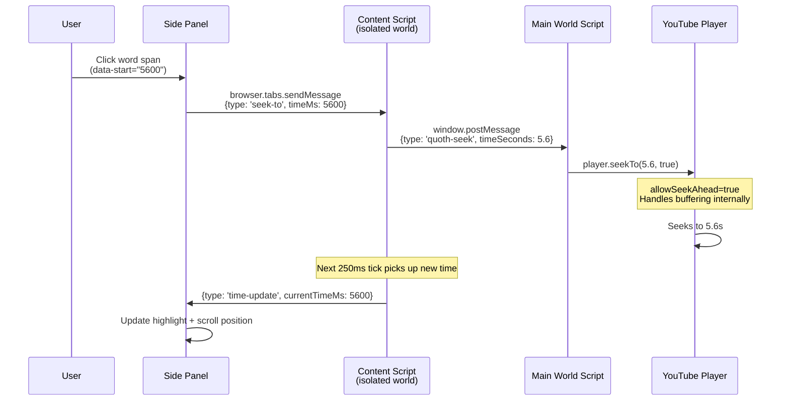
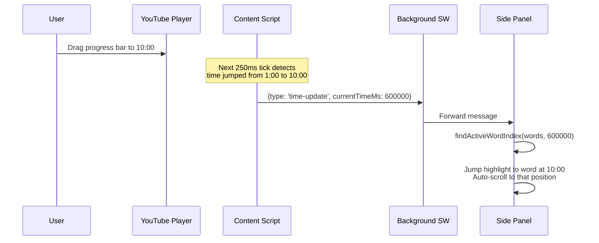
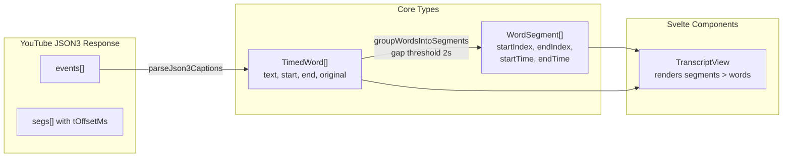

# Quoth Architecture

## Extension Component Model

The extension runs across four isolated JavaScript contexts that communicate
via message passing.

**Why two content scripts?** Chrome MV3 content scripts run in an "isolated
world" -- they can access the page DOM but not the page's JavaScript globals.
YouTube's player API (`player.seekTo()`, `player.playVideo()`) is only
available in the page's main world. So we have:

- `content.ts` (isolated world): handles extension messaging, fetches captions
  via the Innertube API, reads `video.currentTime` for playback sync
- `youtube-player.content.ts` (main world): receives seek commands via
  `window.postMessage` and calls YouTube's player API

---

## Flow 1: Loading the Transcript

When the user opens a YouTube video and clicks the Quoth extension icon.

**Key detail:** The content script uses YouTube's Innertube API with an ANDROID
client context (`clientName: 'ANDROID'`). This returns caption URLs that work
without browser cookies, unlike the URLs embedded in the web page's
`ytInitialPlayerResponse` which require session cookies for the timedtext fetch.

---

## Flow 2: Playback Sync (Video Playing)

While the video plays, the transcript highlights the current sentence and
auto-scrolls.

**Performance:** The binary search in `findActiveWordIndex` is O(log n) over
the sorted `TimedWord[]` array. For a 45-minute video with ~6000 words, this
is about 13 comparisons per update. The 250ms interval (4 updates/second) is
sufficient for smooth highlighting without excessive CPU usage.

---

## Flow 3: Click-to-Seek (User Clicks a Word)

When the user clicks a word in the transcript to jump the video to that time.

**Why `player.seekTo()` instead of `video.currentTime`?** YouTube's player API
handles buffering, ad state, and seek-ahead internally. Setting
`video.currentTime` directly can cause the player to crash when seeking to
unbuffered regions.

---

## Flow 4: YouTube Controls Seek (User Drags Progress Bar)

When the user seeks using YouTube's own progress bar or keyboard shortcuts.

No special handling needed -- the same 250ms polling loop that drives playback
sync also handles external seeks. The transcript catches up on the next tick.

---

## Data Model

**TimedWord** is the atomic unit. Each word has millisecond-precision start/end
timestamps inherited from YouTube's caption data. Auto-generated captions
provide word-level timing directly. Manual captions are interpolated (even
distribution of segment duration across words).

**WordSegment** groups consecutive words with small gaps (<2 seconds) into
visual paragraphs. These map to YouTube's original caption event boundaries
and provide the paragraph-level timestamps shown in the transcript.
