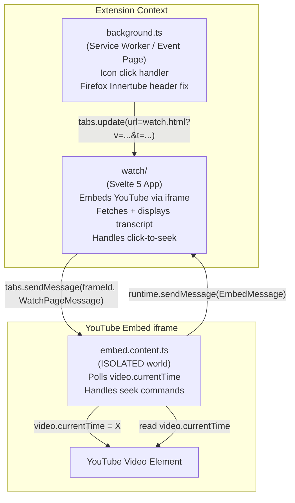
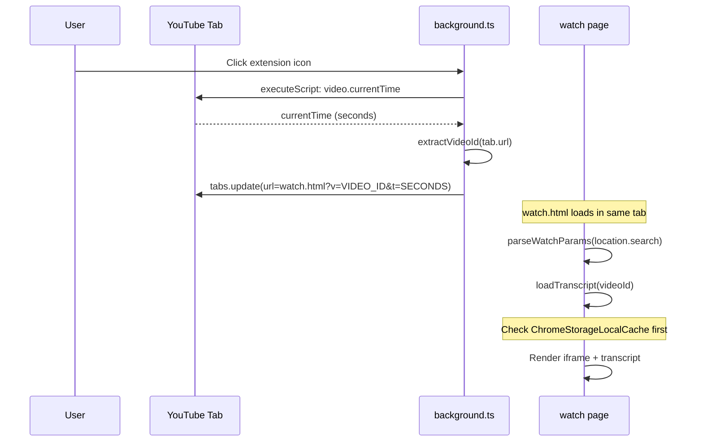
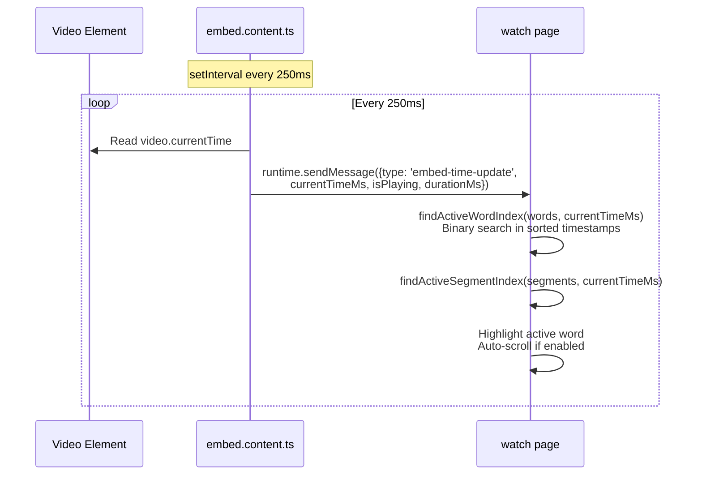
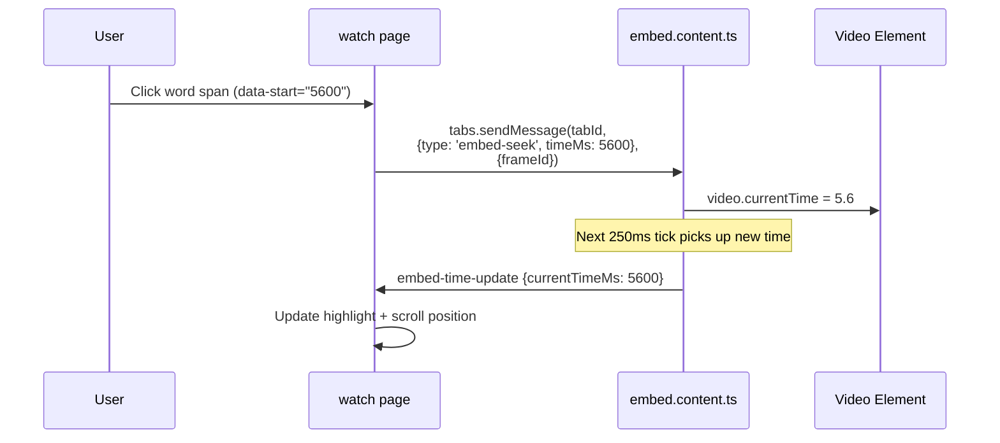
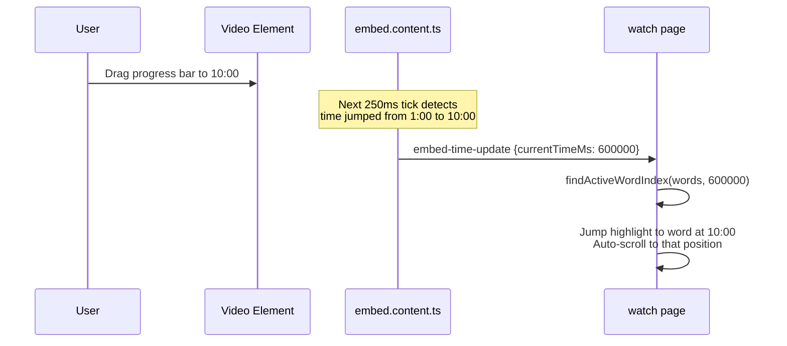
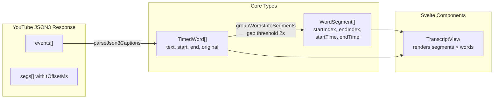

# Quoth Architecture

Runtime architecture of the browser extension: the isolated contexts, how they
communicate, and the high-level flows. For internal code structure (hexagonal
architecture, ports, and adapters), see `docs/spec/design.md`.

## Extension Component Model

The extension runs across two isolated JavaScript contexts plus one content
script injected into embedded iframes.

**Why a content script in the embed iframe?** The watch page's iframe loads
`youtube.com/embed/*`. The extension injects `embed.content.ts` into that
origin (via `allFrames: true`). The content script has direct DOM access to the
`<video>` element inside the iframe, so it can poll `video.currentTime` without
any YouTube API restrictions. Seek commands set `video.currentTime` directly --
no main-world bridge or YouTube player API is needed because we control the
embed iframe.

**Why the background script is minimal:** Its only job is handling icon clicks
(navigating the current YouTube tab to `watch.html`) and applying a Firefox
header fix for Innertube requests. No messages are routed through it.

---

## Messaging Model

Two message types flow between `embed.content.ts` and the watch page.

| Type | Direction | API | Purpose |
|---|---|---|---|
| `EmbedMessage` (`embed-time-update`) | embed.content.ts -> watch page | `browser.runtime.sendMessage` | Reports current video time, playing state, duration every 250ms |
| `WatchPageMessage` (`embed-seek`) | watch page -> embed.content.ts | `browser.tabs.sendMessage(tabId, msg, { frameId })` | Commands the embed to seek to a timestamp |

The watch page learns the embed's `tabId` and `frameId` from the first
`embed-time-update` it receives (via `sender.tab.id` and `sender.frameId`).

---

## Flow 1: Opening the Watch Page

When the user clicks the extension icon on a YouTube watch page.

The extension icon is disabled by default and enabled per-tab only when the
current tab URL matches a YouTube `/watch` page (via `tabs.onUpdated`).

---

## Flow 2: Playback Sync (Video Playing)

While the video plays, the transcript highlights the current word and
auto-scrolls.

**Performance:** The binary search in `findActiveWordIndex` is O(log n) over
the sorted `TimedWord[]` array. For a 45-minute video with ~6000 words, this
is about 13 comparisons per update. The 250ms interval (4 updates/second) is
sufficient for smooth highlighting without excessive CPU usage.

---

## Flow 3: Click-to-Seek (User Clicks a Word)

When the user clicks a word in the transcript to jump the video to that time.

Setting `video.currentTime` directly works here because the embed iframe is
fully under the extension's control -- we injected the content script, and
there are no buffering surprises from YouTube's player API.

---

## Flow 4: YouTube Controls Seek (User Drags Progress Bar)

When the user seeks using the YouTube player's own controls inside the embed.

No special handling needed -- the same 250ms polling loop that drives playback
sync also handles external seeks. The transcript catches up on the next tick.

---

## Data Model

**TimedWord** is the atomic unit. Each word has millisecond-precision start/end
timestamps inherited from YouTube's caption data. Auto-generated captions
provide word-level timing directly. Manual captions are interpolated (even
distribution of segment duration across words).

**WordSegment** groups consecutive words with small gaps (<2 seconds) into
visual paragraphs. These map to YouTube's original caption event boundaries
and provide the paragraph-level timestamps shown in the transcript.

---

## Cross-Browser Differences

Quoth supports both Chrome and Firefox. The differences are limited to the
embed URL strategy and the icon click API.

| Aspect | Chrome | Firefox |
|---|---|---|
| Manifest version | MV3 | MV2 |
| Icon click API | `chrome.action.onClicked` | `browser.browserAction.onClicked` |
| Embed URL | Direct `youtube.com/embed/*` | GitHub Pages intermediary (`tednaleid.github.io/quoth/yt-embed.html`) |
| Innertube Origin fix | DNR rule strips `chrome-extension://` Origin | `webRequest.onBeforeSendHeaders` rewrites Origin to `https://www.youtube.com` |

**Why Firefox needs an embed intermediary:** YouTube's embed player requires a
real HTTPS parent origin for cookie handling and bot verification. A
`moz-extension://` parent origin triggers bot checks. A static page on GitHub
Pages serves as an intermediary that wraps the embed with a real HTTPS origin,
which satisfies YouTube's requirements.

**WXT handles manifest conversion automatically.** We declare a single
`wxt.config.ts`; WXT generates the correct manifest for each browser, including
MV2 vs MV3 differences and permission handling.
