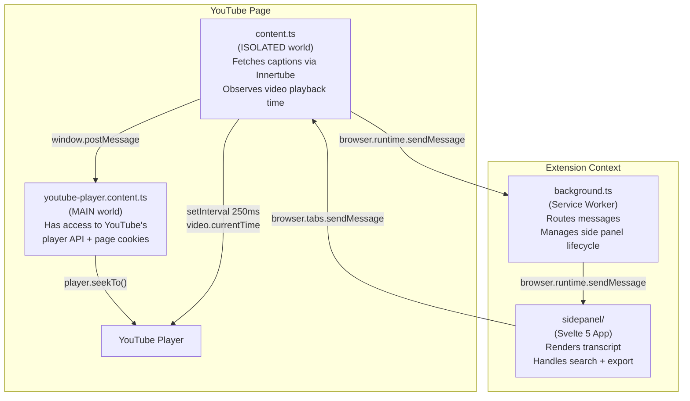
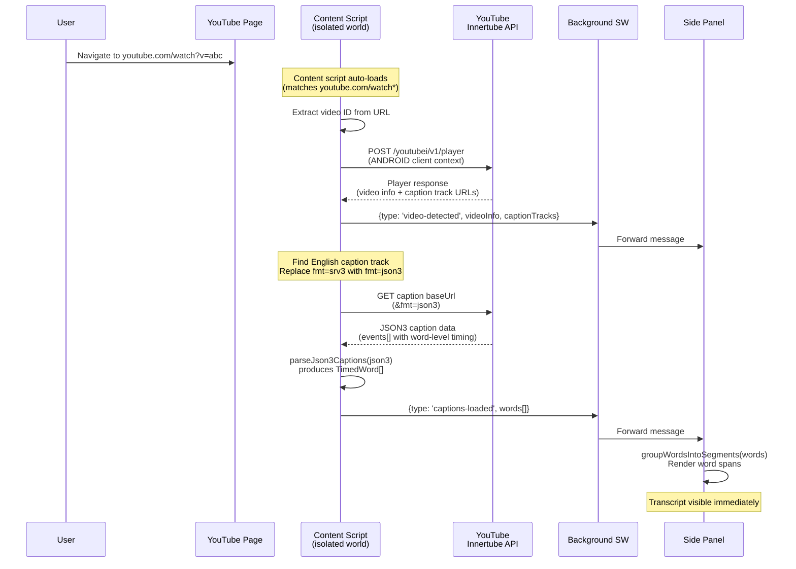
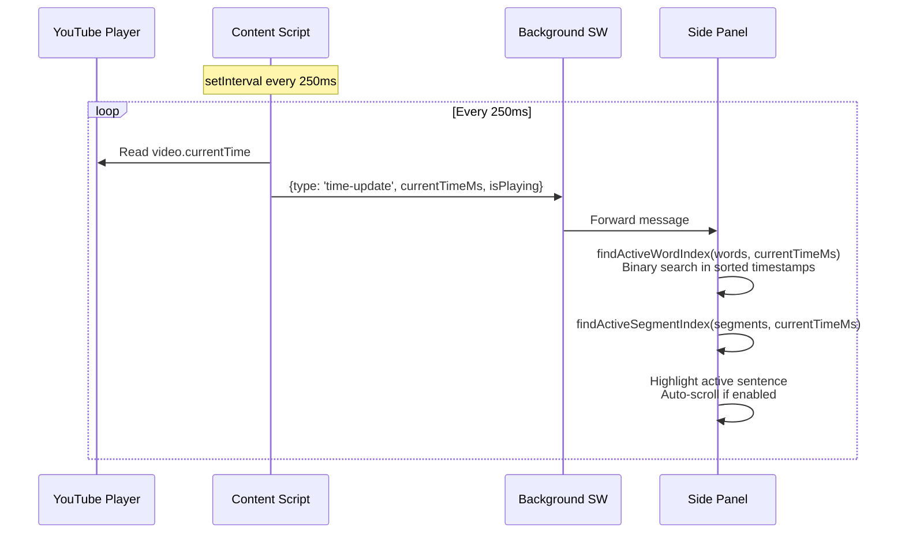
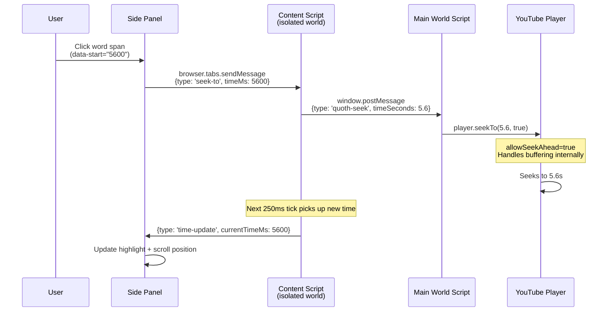
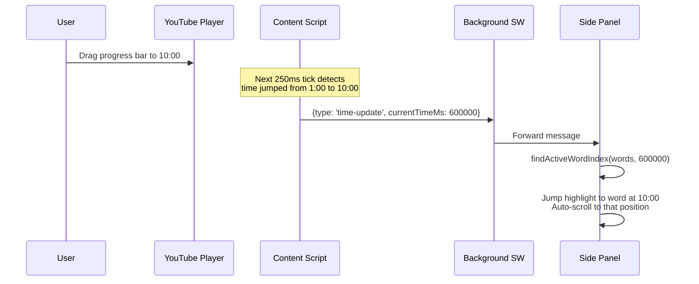
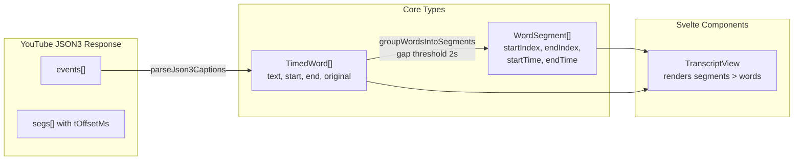
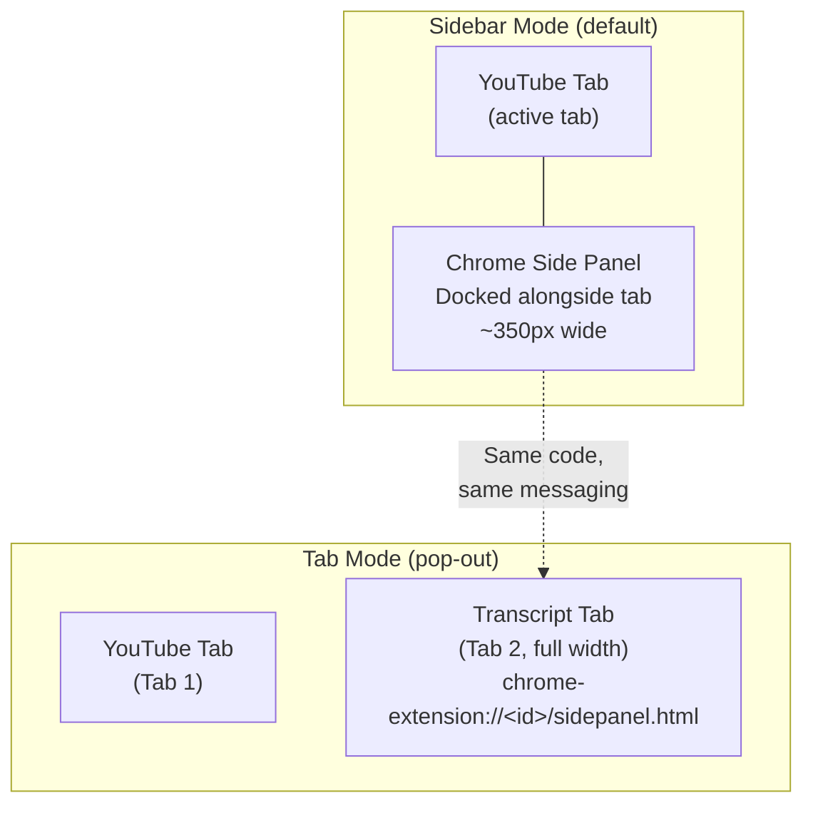

# Quoth Architecture

## Extension Component Model

The extension runs across four isolated JavaScript contexts that communicate
via message passing.



**Why two content scripts?** Chrome MV3 content scripts run in an "isolated
world" -- they can access the page DOM but not the page's JavaScript globals.
YouTube's player API (`player.seekTo()`, `player.playVideo()`) is only
available in the page's main world. So we have:

- `content.ts` (isolated world): handles extension messaging, fetches captions
  via the Innertube API, reads `video.currentTime` for playback sync
- `youtube-player.content.ts` (main world): receives seek commands via
  `window.postMessage` and calls YouTube's player API

---

## Flow 1: Loading the Transcript

When the user opens a YouTube video and clicks the Quoth extension icon.



**Key detail:** The content script uses YouTube's Innertube API with an ANDROID
client context (`clientName: 'ANDROID'`). This returns caption URLs that work
without browser cookies, unlike the URLs embedded in the web page's
`ytInitialPlayerResponse` which require session cookies for the timedtext fetch.

---

## Flow 2: Playback Sync (Video Playing)

While the video plays, the transcript highlights the current sentence and
auto-scrolls.



**Performance:** The binary search in `findActiveWordIndex` is O(log n) over
the sorted `TimedWord[]` array. For a 45-minute video with ~6000 words, this
is about 13 comparisons per update. The 250ms interval (4 updates/second) is
sufficient for smooth highlighting without excessive CPU usage.

---

## Flow 3: Click-to-Seek (User Clicks a Word)

When the user clicks a word in the transcript to jump the video to that time.



**Why `player.seekTo()` instead of `video.currentTime`?** YouTube's player API
handles buffering, ad state, and seek-ahead internally. Setting
`video.currentTime` directly can cause the player to crash when seeking to
unbuffered regions.

---

## Flow 4: YouTube Controls Seek (User Drags Progress Bar)

When the user seeks using YouTube's own progress bar or keyboard shortcuts.



No special handling needed -- the same 250ms polling loop that drives playback
sync also handles external seeks. The transcript catches up on the next tick.

---

## Data Model



**TimedWord** is the atomic unit. Each word has millisecond-precision start/end
timestamps inherited from YouTube's caption data. Auto-generated captions
provide word-level timing directly. Manual captions are interpolated (even
distribution of segment duration across words).

**WordSegment** groups consecutive words with small gaps (<2 seconds) into
visual paragraphs. These map to YouTube's original caption event boundaries
and provide the paragraph-level timestamps shown in the transcript.

---

## Sidebar Mode vs Tab Mode

The side panel page (`sidepanel.html`) is a standalone Svelte app that works
in two modes. The same HTML/JS runs in both -- it discovers the YouTube tab
via `browser.tabs.query` and communicates via extension messaging regardless
of how it's rendered.



### How tab mode works

The side panel app finds the YouTube tab by querying for matching URLs:

```typescript
const [ytTab] = await browser.tabs.query({ url: '*://*.youtube.com/watch*' });
if (ytTab?.id) {
  browser.tabs.sendMessage(ytTab.id, { type: 'request-state' });
}
```

This works identically whether the app runs as a Chrome side panel or as a
standalone tab. The content script on the YouTube page doesn't know or care
which mode the side panel is in -- it receives the same messages and responds
the same way.

### Opening tab mode manually

1. Find the extension ID: go to `chrome://extensions`, find Quoth, copy the ID
2. Open a new tab to: `chrome-extension://<extension-id>/sidepanel.html`
3. Navigate to a YouTube video in another tab
4. The transcript loads and syncs automatically

### Opening tab mode programmatically

From any extension context (background script, side panel, popup):

```typescript
browser.tabs.create({
  url: browser.runtime.getURL('sidepanel.html'),
});
```

This is what the smoke test does via Playwright, and what a "pop out to tab"
button in the side panel header would do.

### What tab mode gives you

| Feature | Sidebar | Tab |
|---------|---------|-----|
| Video + transcript visible at once | Yes (side by side) | No (tab switch) |
| Transcript width | ~350px fixed | Full tab width |
| Native Ctrl+F search | No (panel) | Yes (browser search) |
| Text selection + copy | Awkward in narrow panel | Full browser support |
| Separate window | No | Yes (drag tab out) |
| Bookmarkable | No | Yes |
| Playwright testable | No (no API to open side panel) | Yes (full DOM access) |

### Automated testing uses tab mode

Playwright cannot programmatically open Chrome's side panel (no API exists).
The smoke test (`just smoke-test`) opens `sidepanel.html` as a regular tab,
which gives Playwright full DOM access for clicking words, reading transcript
content, and verifying seek behavior. This is functionally identical to sidebar
mode because the same code and messaging paths are used.
